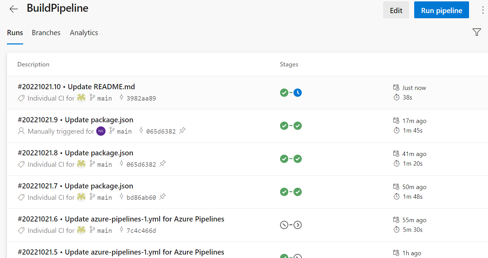
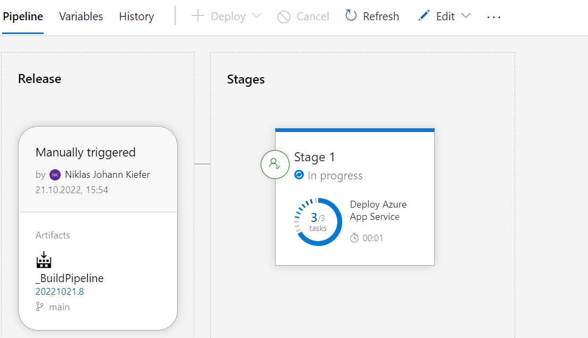

# Lab2
The task of this lab is to build an azure devops pipeline using NodeJS. Using DevOps, this app should automatically be deployed when commited. The NodeJS app should be provided with test cases. There should be a build pipeline aswell as a release pipeline, that accepts a release in production. But there should be a manual check before release. Finally, Azure Application Insights should be implemented.

## Links
[Web App for development](https://lab2dbuild.azurewebsites.net/).
[Web App for production](https://lab2release.azurewebsites.net/).

## Screenshots
Build Pipeline:

Release Pipeline:

## How the release is approved.
After a commit and therefore a deploy through the build pipeline, it has to be approved.

Whoever approves the build, can write a comment for the approval.

After that, the deploy should be approved and deployed to release.

## My experience
First, after creating a simple NodeJS application, I created a project in Azure DevOps using this repository. Then I added  my first pipeline for building, which I called "Lab2build". The pipeline deployed automatically, when committing to the repository. At first, deploying did not work, but after I have changed the path of the app by changing the script in the pipeline, it worked. I then added a test and build script to the node js app, and was able to successfully deploy. When I checked the pagein azure, it was not able to show the hello world message on the screen. While It is able to deploy, it won't show anything in the browser. 
After finishing the pipeline, I created a release pipeline, which worked with manual checking when deployed to the Lab2build pipeline. After I approve the build, It will automatically be deployed to "Lab2release".
At lat, I implemented Azure Application Insights into my application.
