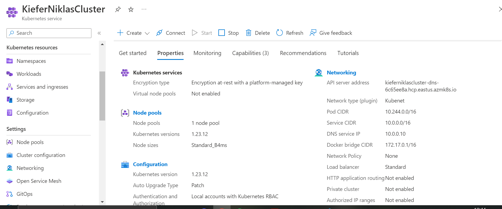

# Lab4
The goal of this lab is to learn how to use kubernetes, in order to deploy applications to it. The following tasks have tu be fulfilled.
- Create and configure a kubernetes AKS cluster
- Configure and deploy Wordpress + MySQL containers into the AKS cluster.

## Creating and configuring the AKS cluster
Before being able to work with a cluster, it has to be created first. This can be done in multiple ways. First, you can use the CLI from azure to do this. The other way is to use the azure portal to create a AKS service.

I wanted to create the cluster manually using the command line, but I got repeated errors when using it due to quota errors. Instead, I just used the azure portal with the help of [this tutorial](https://learn.microsoft.com/en-us/azure/aks/learn/quick-kubernetes-deploy-portal?tabs=azure-cli). With the tutorial, It was no problem to set up the AKS cluster. I used mainly default set ups as well as the Dev/Test preset for testing out kubernetes. The resulting cluster looks as follows:


After finishing the set up, the next step was to deploy a service.


## Configure and Deploy Wordpress + MySQL
For this part, I used [this kubernetes tutorial](https://kubernetes.io/docs/tutorials/stateful-application/mysql-wordpress-persistent-volume/) and [this microsoft tutorial](https://learn.microsoft.com/en-us/azure/aks/tutorial-kubernetes-deploy-application?tabs=azure-cli).

The first step was to create the kustomization.yaml manifest file. It contains a secret generator for a password secret used by mysql and wordpress, as well as a reference to both deployment files, [wordpress.deployment.yaml](https://github.com/NiklasKiefer/SoftwareDeploymentILV/blob/main/Lab4/wordpress-deployment.yaml) and [mysql.deployment.yaml](https://github.com/NiklasKiefer/SoftwareDeploymentILV/blob/main/Lab4/mysql-deployment.yaml).

The next step was to create said deployment files, which contains the services themselves, as well as a persistent volume and a deployment. They use the password secret defined in the kustomization.yaml file.

After creating them, the final step was to deploy them to the previously created kubernetes cluster. This can be done by performing the apply command:
```
kubectl apply -k ./
```
The output should look like this:
```
secret/mysql-pass-abcdefgh created
service/wordpress created
service/wordpress-mysql created
persistentvolumeclaim/mysql-pv-claim created
persistentvolumeclaim/wp-pv-claim created
deployment.apps/wordpress created
deployment.apps/wordpress-mysql created
```
Make sure that all objects are created and running my typing the following command:
```
kubectl get [secrets/pods/pvc/...]
```
Now after everything is finished, the last thing left to do is to look at the deployed website. In order to do that, we need the IP of the service, which can be optained by typing the following command:
```
kubectl get service wordpress --watch
```
This results in the following being displayed:
```
NAME        TYPE           CLUSTER-IP   EXTERNAL-IP      PORT(S)        AGE
wordpress   LoadBalancer   <your ip>    52.151.238.237   80:31005/TCP   12m
```
The external IP is the address of your website. You can access it by typing it into your browser.

## Access the website
The website can be accessed using the IP [52.151.238.237](http://52.151.238.237)
